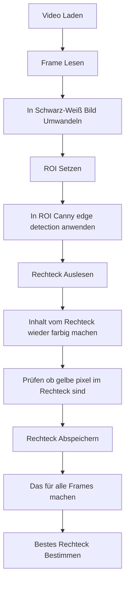

# new-world-stamina-checker

## Pipeline vom Algo t.py

```mermaid
flowchart TD
    A[Video Laden] --> B[Frame Lesen]
    B --> C[In Schwarz-Weiß Bild Umwandeln]
    C --> Q[ROI Setzen]
    Q --> W[In ROI Canny edge detection anwenden]
    W --> E[Rechteck Auslesen]
    E --> R[Inhalt vom Rechteck wieder farbig machen]
    R --> T[Prüfen ob gelbe pixel im Rechteck sind]
    T --> Z[Rechteck Abspeichern]
    Z --> U[Das für alle Frames machen]
    U --> I[Bestes Rechteck Bestimmen]

```